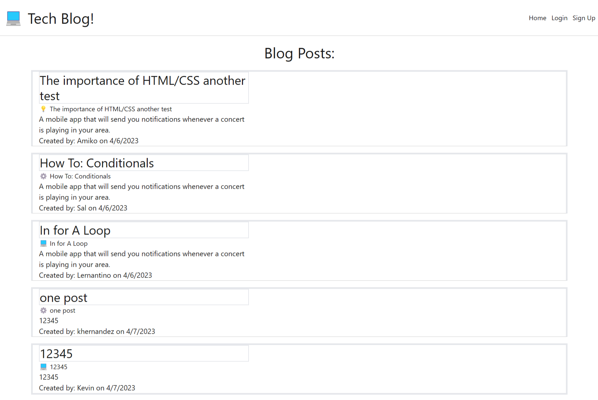

# BlogPage

## Screenshot of Application

## Link to deployed Application
<a href="https://polar-ridge-60825.herokuapp.com/">Link to deployed Application</a>

  ## Description
  Here we will find a tech blog that will allow you to post your thoughts to the page, after creating an account. This application will also allow you to comment on other's Posts!
  ## Installation

  ## Usage
  download repo, npm install, npm start to initiate server and redirect to your localhost:3001 and the page should be active
  
  ## Questions
 If you have any questions regarding this project, Please contact me at: 
  GitHub: https://github.com/khernandez0810@gmail.com  
  Email: khernandez0810@gmail.com
  ## Credits
  Kevin Hernandez